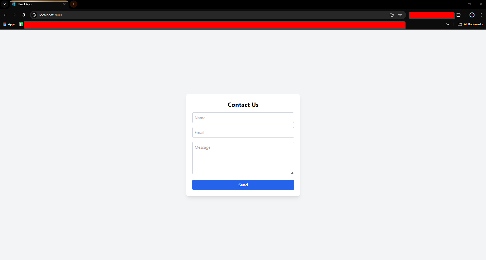

# Serverless Contact Form

This is a modern serverless contact form built using **AWS Lambda**, **Amazon SES (Simple Email Service)**, **React**, and **Tailwind CSS**. The form allows users to send messages directly from a web interface, and emails are delivered to the specified recipient email address using AWS SES. The backend logic is fully serverless, powered by AWS Lambda, making it highly scalable and cost-efficient.

## Features

- Serverless architecture: No need to manage servers. The backend is powered by AWS Lambda.
- Email sending via AWS SES: Users' messages are sent directly to your email address using Amazon's Simple Email Service.
- Form validation: The form includes basic client-side and server-side validation to ensure valid input before sending.
- Environment variable management: Sensitive information like email addresses are managed through environment variables using dotenv.
- CStyled with Tailwind CSS: A modern, responsive design built using the utility-first framework Tailwind CSS.

## Demo



You can try out the form on the live demo link (if hosted) or run it locally by following the instructions below.

## Tech Stack

- Frontend: React, Tailwind CSS
- Backend: AWS Lambda, AWS SES
- Deployment: AWS Lambda & S3
- Environment Management: dotenv

## Getting Started

These instructions will help you set up and deploy the project on your local machine for development and testing purposes.

### Prerequisites

Before you begin, ensure that you have the following installed:

- **Node.js** (v14 or higher)
- **AWS CLI** (configured with your AWS credentials)
- **AWS Account** (with SES verified email addresses)
- **VS Code** (or your preferred IDE)

### Installing

1. Clone the repository:

```bash
git clone https://github.com/patrick-231/aws-serverless-lambda-contact-form.git
```

2. Navigate to the project directory:

```bash
cd serverless-contact-form-app
```

3. Install dependencies:

```bash
npm install
```

4. Configure AWS SDK in your project and ensure your Lambda function is set up to use AWS SES for sending emails.

5. Create a .env file in the project root and add your email address for AWS SES:

```bash
SOURCE_EMAIL=your-email@example.com
```

### Running the App Locally

1. To start the React development server, run:

```bash
npm start
```

2. Visit http://localhost:3000 in your browser.

### Deploying to AWS Lambda

To deploy the Lambda function, zip the necessary files and upload them via the AWS Lambda console or use the Serverless framework (if configured):

1. Run the following command to create a .zip of your Lambda function:

```bash
zip -r contact-form.zip . -x "*.git*" "node_modules/*"
```

2. Upload the zip to your AWS Lambda function using the AWS Console or CLI.
3. Configure your environment variables (like SOURCE_EMAIL) in the Lambda console.

### Environment Variables

The following environment variable should be added to your AWS Lambda configuration:

```bash
SOURCE_EMAIL=your-email@example.com
```

### Tailwind CSS Styling

The form is styled using Tailwind CSS. You can customize the form's appearance by editing the App.js or adding more styles in index.css.

### Example Lambda Function

Here's a basic example of the Lambda function responsible for handling the form submissions:

```bash
const AWS = require("aws-sdk");
const ses = new AWS.SES({ region: "eu-central-1" });
require("dotenv").config();  // Load environment variables from .env

exports.handler = async (event) => {
  const { name, email, message } = JSON.parse(event.body);

  // Input validation
  if (!name || !email || !message) {
    return {
      statusCode: 400,
      body: JSON.stringify({ message: "All fields are required." }),
    };
  }

  const emailRegex = /^[^\s@]+@[^\s@]+\.[^\s@]+$/;
  if (!emailRegex.test(email)) {
    return {
      statusCode: 400,
      body: JSON.stringify({ message: "Please enter a valid email address." }),
    };
  }

  const params = {
    Destination: {
      ToAddresses: [email],
    },
    Message: {
      Body: {
        Text: { Data: `Message from ${name} (${email}):\n\n${message}` },
      },
      Subject: { Data: "Contact Form Submission" },
    },
    Source: process.env.SOURCE_EMAIL,
  };

  try {
    await ses.sendEmail(params).promise();
    return {
      statusCode: 200,
      body: JSON.stringify({ message: "Email sent successfully!" }),
    };
  } catch (error) {
    console.error("Error sending email:", error);
    return {
      statusCode: 500,
      body: JSON.stringify({
        message: "Failed to send email. Please try again later.",
      }),
    };
  }
};

```

### License

This project is licensed under the MIT License - see the LICENSE file for details.

### Acknowledgements

- [AWS SES Documentation](https://docs.aws.amazon.com/ses/latest/DeveloperGuide/Welcome.html)
- [AWS Lambda Documentation](https://docs.aws.amazon.com/lambda/latest/dg/welcome.html)
- [Tailwind CSS](https://tailwindcss.com)
